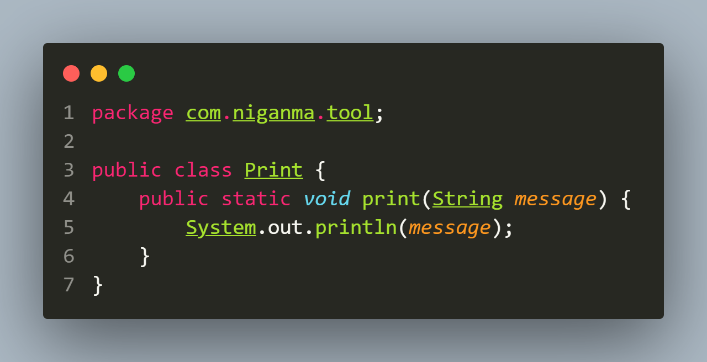
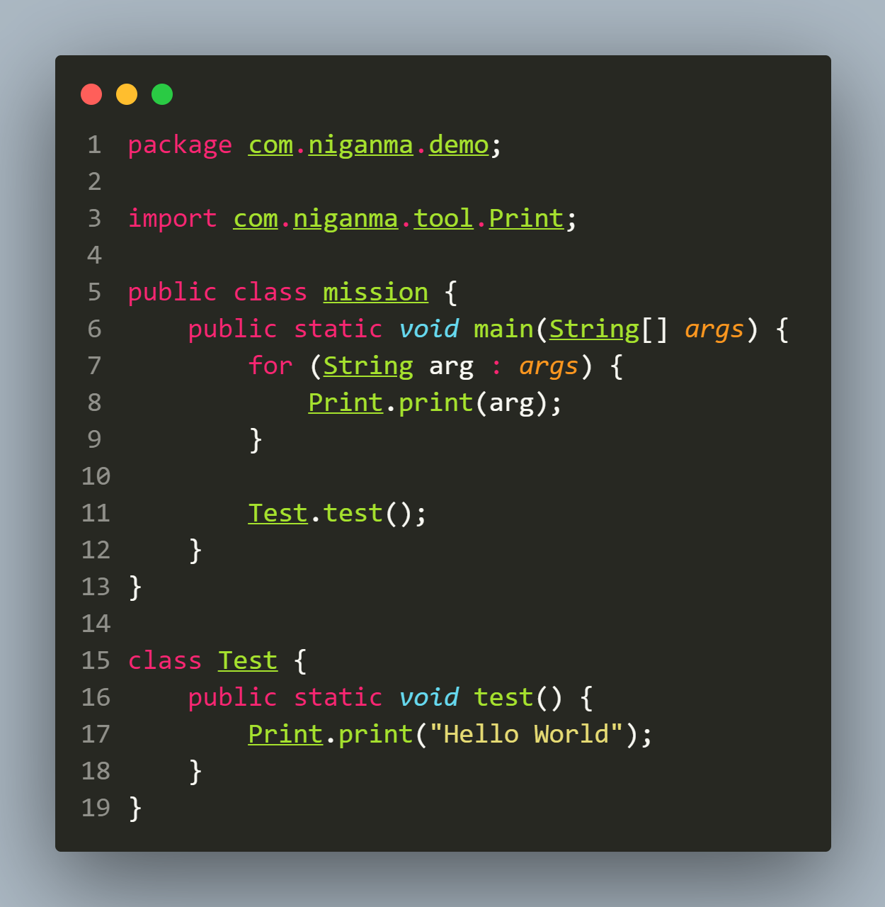

```
package com.ISEKAI;
/*------------------------------------*/
import com.ISEKAI.tool.Print;
/*------------------------------------*/
public class HelloWorld {
       public static void main(String[] args){
           Test.test();
       }
}
/*------------------------------------*/
class Test{
   public static void test(){
       Print.print("Hello World");
   }
}
```
### 1. 可以看到，这份代码被分成了四个部分，请尝试解释每个部分，回答什么是包（pakage），包的作用是什么，什么是main函数，并总结出一个单文件java程序的基本结构
```
package com.ISEKAI;
/*这个是包声明,说明这个包是"com.ISEKAI"*/
import com.ISEKAI.tool.Print;
/*这个是导入语句,就是导包,把"com.ISEKAI.tool"这个
包里的"Print"类导进去,就可以在当前文件直接用这个类了*/
public class HelloWorld {
       public static void main(String[] args){
           Test.test();
       }
}
/*这个是主类声明,这里包含了程序的入口,即main方
法,然后这里main 方法调用了 Test 类的 test 方法*/
class Test{
   public static void test(){
       Print.print("Hello World");
   }
}
/*这个是内部类声明,是个内部类Test,里面定义了个
test方法,这个方法里面又使用了Print类里面的
print方法,从而打印了一个字符串 "Hello World" */
```
-   包（package）：
包是一种封装类和接口的方式，用于组织大型的Java应用程序。在代码中, ***package com.ISEKAI;*** 声明了这个类属于**com.ISEKAI**包。
-   包的作用：
    -   防止命名冲突：不同的包可以包含相同名称的类，因为它们在不同的命名空间中。
    -   封装和组织：将相关的类和接口组织在一起，便于管理和维护。
    -   控制访问权限：通过设置包的访问级别，可以控制其他包对当前包中类和接口的访问。(就好比用*private*修饰吧)
-   main函数：
main 方法是Java程序的入口点，当程序运行时，main 方法会被首先执行。它是一个特殊的方法，因为它可以被Java运行时环境调用。main 方法必须被声明为 ***public static void***，并且接受一个 String 类型的数组作为参数，这个数组包含了命令行传入的参数。
- 单文件Java程序的基本结构：
  -   包声明：*package* 语句，用于声明类所在的包。
  -   导入语句：*import* 语句，用于导入其他包中的类或整个包。(有些包用不到导入)
  -   类声明：使用 *public class* 声明一个公共类。
  -   类成员：类中的变量、方法等成员。
  -   main 方法：程序的入口点，包含***public static void main(String[] args)***。
  -   类的私有成员和方法：可以包含私有的类、方法和变量。
### 2. 在运行程序时，可以给程序传入参数，由main函数的args参数接收，请你更改main函数，使用命令行或者IDEA运行这个程序传入“111 222 333”这三个参数，并在main函数中打印出来。
- 更改过后的程序(在本文件夹Java02的src里面):
 


-   用IDEA运行这个程序传入“111 222 333”这三个参数，并在main函数中打印出来:


------------
### 3.
##### 在你本地的IDEA中创建上述结构的java项目，*HelloWorld.java*文件的内容前面已经给出，现在请你写出*Print.java*文件中的代码，使得该Java项目能正常运行并打印出“Hello World”。
-   在本地的IDEA中创建上述结构的java项目:

-   请你写出*Print.java*文件中的代码:

-   使得该Java项目能正常运行并打印出“Hello World”:
